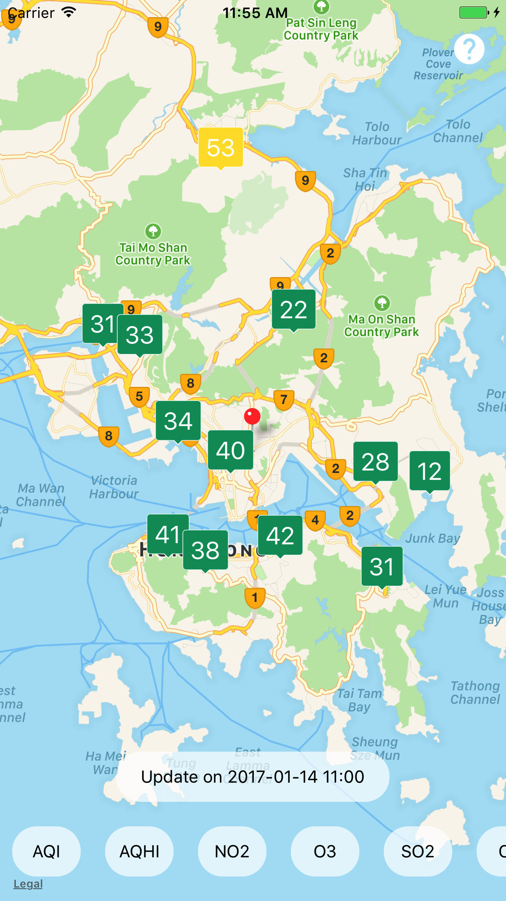
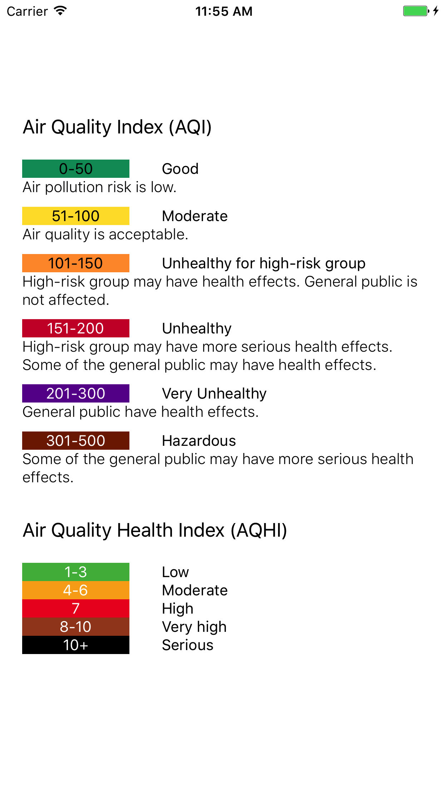

# HKAQI - Air Quality Index

 

## Download

## Screenshots

## React and React Native version

* [react](https://github.com/facebook/react): 15.3.1
* [react-native](https://github.com/facebook/react-native): 0.37.0

## Plugins used

* [react-native-admob](https://github.com/sbugert/react-native-admob) - A react-native component for Google AdMob banners.
* [react-native-android-location](https://github.com/syarul/react-native-android-location) - A React Native location acquisition through network or GPS without using Google Play Service.
* [react-native-background-fetch](https://github.com/transistorsoft/react-native-background-fetch) - iOS Background Fetch API Implementation.
* [react-native-device-info](https://github.com/rebeccahughes/react-native-device-info) - Device Information for React Native iOS and Android.
* [react-native-google-analytics-bridge](https://github.com/idehub/react-native-google-analytics-bridge) - React Native bridge to the Google Analytics libraries on both iOS and Android.
* [react-native-location](https://github.com/timfpark/react-native-location) - React Native plug-in that provides GPS location information.
* [react-native-maps](https://github.com/airbnb/react-native-maps) - React Native Mapview component for iOS + Android.
* [react-native-push-notification](https://github.com/zo0r/react-native-push-notification) - React Native Local and Remote Notifications.
* [react-native-router-flux](https://github.com/aksonov/react-native-router-flux) - React Native Router based on new React Native Navigation API.
* [react-native-simple-store](https://github.com/jasonmerino/react-native-simple-store) - A minimalistic wrapper around React Native's AsyncStorage.
* [react-native-timer](https://github.com/fractaltech/react-native-timer) - Manage timers in react-native.
* [react-native-vector-icons](https://github.com/oblador/react-native-vector-icons) - 3000 Customizable Icons for React Native with support for NavBar/TabBar/ToolbarAndroid, image source and full stying.

## Additional

* [eslint](https://github.com/eslint/eslint): A fully pluggable tool for identifying and reporting on patterns in JavaScript.

## Running

#### Clone & install

* Clone this repo `git clone git@github.com:7kfpun/AQIReactNative.git`
* `cd AQIReactNative`
* run `npm install` || run `yarn install`

#### iOS

* Run `react-native run-ios`

#### Android

* Run `android avd` and start an emulator
* Run `react-native run-android`

## License

Released under the [MIT License](http://opensource.org/licenses/MIT).
